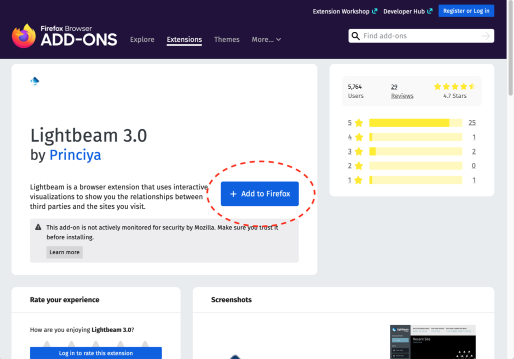

# Lightbeam add-on

This document contains written instructions on how to complete the in-class activities described in the videos of the second module of the course.

In this activity our goal is to get a broad overview of what tracking looks like.

It will also explain some of the terminology more thoroughly compared to the instruction videos for readers with very limited experience with computers.

## Motivation

The purpose of this activity is to show how may companies are constantly collecting data on your private activities as you browse the internet. This requires installing the Lightbeam add-on.

Add-ons are small programs that you can add to your browser such as Firefox or Google Chrome (the program you use to access the internet). They typically make some specific tasks easier in the browser or for example remove unwanted ads. A lot of them are also related to improving your privacy by for example giving information on how websites are trying to collect data on you and even blocking them. 

Lightbeam is an add-on that displays third party tracking cookies that are placed onto your computer as you visit different websited. Third party tracking cookies are programs that collect data on you for example for Facebook or Google when you are visiting totally unrelated websites. 

You can read more about it and install it yourself from going to their webpages for [Lightbeam for Firefox](https://addons.mozilla.org/en-GB/firefox/addon/lightbeam-3-0/) or [Lightbeam for Google Chrome](https://chrome.google.com/webstore/detail/thunderbeam-lightbeam-for/hjkajeglckopdkbggdiajobpilgccgnj?hl=en-GB). 

## Installation instructions

This set of instructions is for the students and the teacher.

First go to google and type into the search "Lightbeam add-on". You should see in the top or near the top of the search Lightbeam's official add-on page of the browser you are using. For example chrome.google.com if you are using Google Chrome or addons.mozilla.org if on Firefox. Go to the page and click the add Add to Firefox (Image 1) or Add to Chrome (Image 2).

 

 

After clicking the button, it will ask for permission to install it. After accepting the installation, an icon for Lightbeam should appear near top right corner.

 

## The activity

First the students should add the Lightbeam to their browser. After adding the extension, they should visit several websites and then click the Lightbeam icon to open the extension. As they visit more sites, more trackers should appear. You should encourage the students to go to websites that they themselves frequently use.

After visiting the sites instruct the students to click on lightbeam icon on their toolbar . This will bring out the Lightbeam tab.

Below is a screenshot (Image 4) of what the findings of Lightbeam look like after visiting just 5 pages. Each ball is a website and triangles are the cookies, which are the small programs that are gathering data on your browser and computer and trying to create a profile so that they can for example sell your information for marketing purposes.

 

After visiting 5 sites, we can see that 58 third party sites are accessing my information. By moving your cursor (mouse) on top of these triangles or balls, it will tell which website it is and who the cookie belongs to.

## Discussion

Ask the students to think about the following questions and encourage them to discuss the findings.

* How do the feel about visiting websites after seeing the results?
* Does it matter if companies are collecting information only for commercial purposes and for targeting ads?
* Which websites had the most cookies?
* Will this information change their behavior online in the future?

\vfill
 This work is licensed under a [Creative Commons Attribution 4.0 International License](http://creativecommons.org/licenses/by/4.0/).
