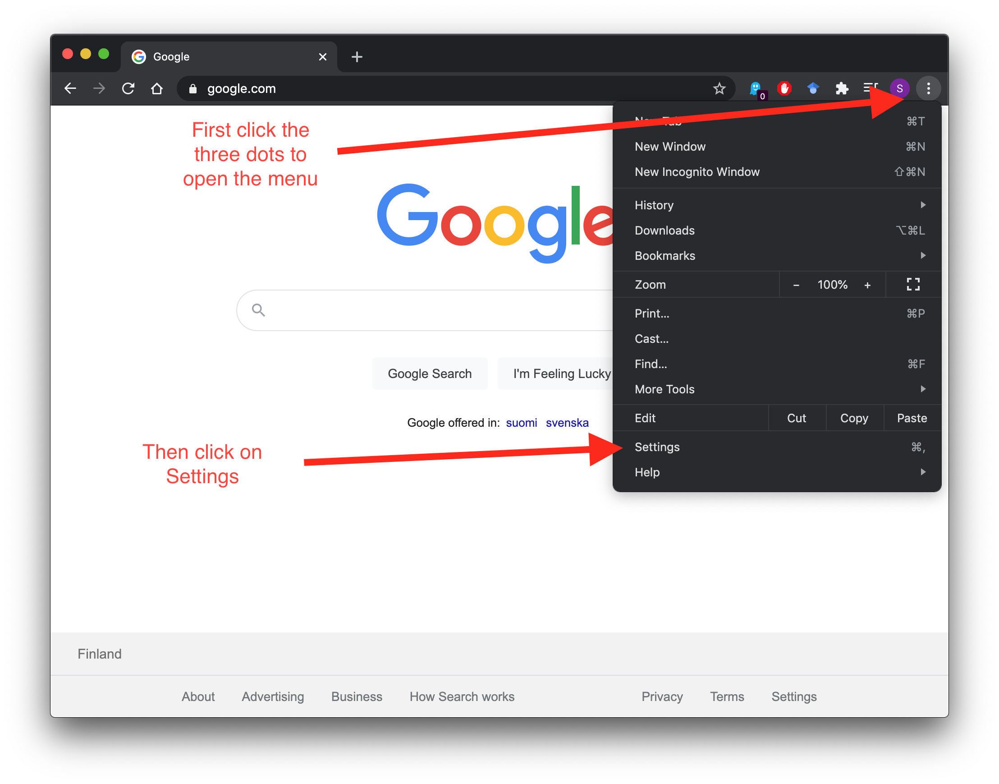
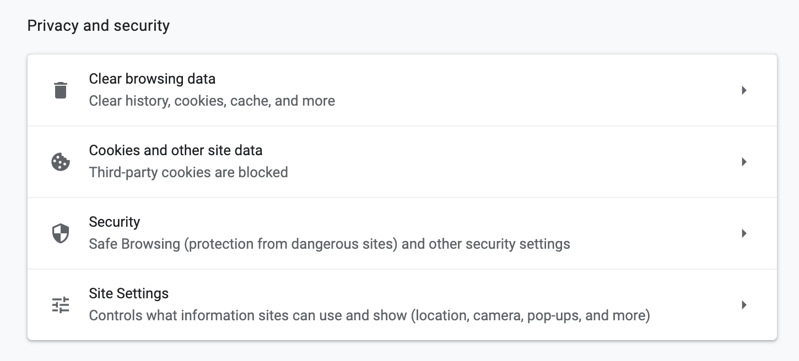
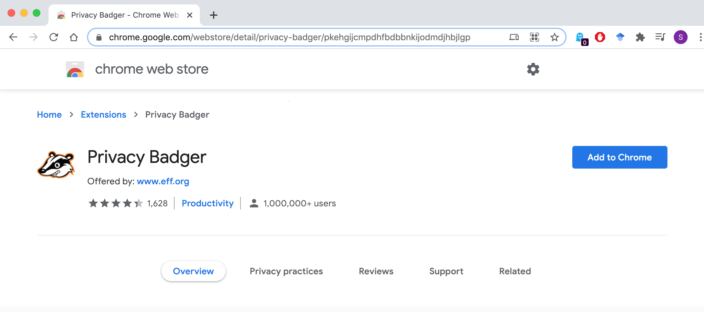
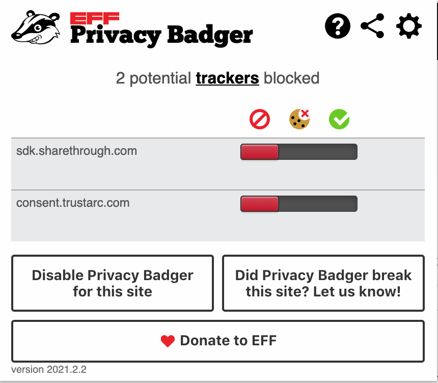

This document contains written instructions on how to complete the in-class activities described in the videos of the second module of the course.

In this activity our goal is to give hands on instructions how to limit Google and other companies from collecting data on you proactively when using the Google Chrome browser. If the student is only using some other browser, then they can independently explore the security and privacy settings on it as there will be similar pages on cookies and privacy settings with the most browsers.

It will also explain some of the terminology more thoroughly compared to the instruction videos for readers with very limited experience with computers.

# Privacy and security settings on Google Chrome browsers

## Motivation

You can determine how much data can be collected from you just by changing the default settings on a browser without needing to use even any add-ons. A common issue in data sharing is that the programs such as Google Chrome always share have no limits on data sharing on default. This activity introduces the students on what controls they have and how to understand and explore different settings that they have on their browsers. 

Later in the session we will also talk about other browser tools that help you reduce your digital footprint, or in other words how much data can be collocted from your computer and browser.

## The activity

Instruct students who use Google Chrome to open the Settings page. You can do so by clicking the three dots on the up right corner. As it opens a drop-down menu, select Settings which will take you to a new tab.

 

From there, select Privacy and Security to move directly to the right section or scroll down the page until you reach it it.

 

Now you can see four different subpages:

 

It is recommended that you clear your browser history and cookies periodically from the Clear Browsing Data page. This reduces how complete of a profile the cookies and thus companies can generate of you.

***NOTE! If you clear everything, you will also lose your saved passwords and prefilled forms such as account names on pages where you log in. This might cause issues if you have forgotten passwords for accounts that you have not set up a recovery email or phone number for.***

The second button opens the Cookies and Other Site Data page which looks like this:

 

Here you can select different levels of blocking of cookies. The recommended basic level to use is "Block Third Party cookies" as this reduces the amount of information companies not related to the page that you are visiting can collect, while allowing cookies used to make the website function properly to work. If selecting "Block All Cookies", some pages will stop working entirely and you will always need to refill forms among other potential issues.

You can also opt to clear cookies every time you close the browser. It is good to understand that while restricting cookies it reduces the information being collected, it also makes the use of many websites slower or clumsier. Some websites even intentionally use so called "hostile design" to make you want to allow cookies by making using the website annoying or difficult without approving them.

Selecting "Do Not Track" sends request for websites for not to collect your information, but in practice there is no enforcement so it might not in reality make a big difference although better to have it on rather than off.

## Discussion

* Discuss the trade-offs of giving data and in return having to fill in information such as the GDPR forms every time you enter a website
* Ask the students to try blocking all cookies and then seeing how it affects their browsing experience
* Ask the students how many Google products they use? 

# Alternatives to Google Search

## Motivation

Every time you use Google's products they get data on you. Every time you search something, it is recorded. One alternative to Google is DuckDuckGo. 

## The activity

Recommend students testing Duck Duck Go and realizing also how different the search results can be if there is no personalization and no data being collected. Note also that other search engines such as Bing exist, but in general unless it is privacy oriented like Duck Duck Go, it will equally attempt to collect data on you like Google does.

Go to the website: https://duckduckgo.com/

## Discussion

* Ask how well Duck Duck Go worked compared to Google
* Ask if the students know alternatives to Google for searching things on the internet

# Other privacy add-ons

## Motivation

There are many different add-ons for increasing privacy online. One example is Privacy Badger, which allows you to see and block cookies more effectively.

As a refresher, add-ons are small programs that you can add to your browser such as Firefox or Google Chrome (the program you use to access the internet). They typically make some specific tasks easier in the browser or for example remove unwanted ads. A lot of them are also related to improving your privacy by for example giving information on how websites are trying to collect data on you and even blocking them. 

It is good to be aware that not all add-ons themselves are safe. In general it is good to if many people have downloaded this and given high ratings and commented on the add-ons on the official Firefox or Chrome add-on pages. Google and Firefox attempt to remove add-ons that are not safe or functioning as they claim to.

## The activity

Search for Privacy Badger on Google and use the Chrome or Firefox add-on sites like earlier when installing Lightbeam or go to www.privacybadger.org to download it.

 

After installing and accepting it to change your privacy settings, go to visit some website and preferably one that you already visited during the Lightbeam activity earlier. Then click the Privacy Badger logo  in the top right corner of your browser window. After clicking it the following window will open:

 

There you can see which cookies it has blocked.

## Discussion

* Ask if students will want to install add-ons like these and keep using them after this session
* Ask if anyone searched and found other interesting privacy add-ons

\vfill
 This work is licensed under a [Creative Commons Attribution 4.0 International License](http://creativecommons.org/licenses/by/4.0/).
