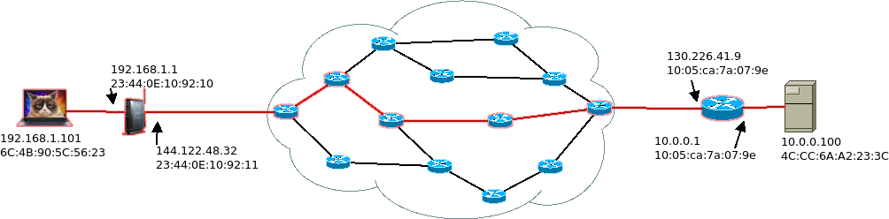
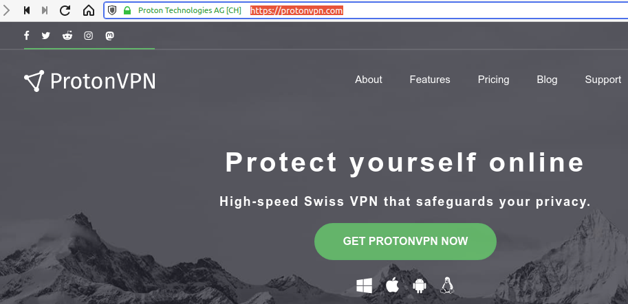
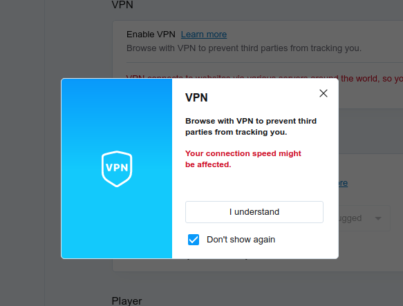
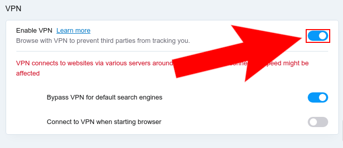

The idea behind a Virtual Private Network (VPN) is you connect to a server, and all your requests to this server is encrypted. So for outside parties the traffic between the device and the server is unreadable. Therefore protected from prying eyes.

A Virtual Private Network (VPN) is often used in corporate settings to encrypt data exchanged between the corporate network and mobile users' devices (working from home/field). In these settings, the VPN server acts as a boundary between the organization's internal network and the internet. The employees connecting to the VPN server don't have to worry about their communication being eaves dropped.

In your use case as private citizens employing VPN to avoid snooping by corporate or private snooping. The use case is slightly different. Instead of connecting to an internal company network, you use the VPN server as a proxy (inbetween) between you and the internet.

Now let us recall how your internet traffic worked before the VPN. You made a request to the server and your traffic went from your computer to the target server without any encryption beyond the protocols used (this is the red line). This meant some or all your traffic could be easily intercepted, and your connection metadata (which servers you communicated with and when). Could easily be tracked by parties operating the routers.

When you use a VPN server as a proxy, your traffic first goes into the VPN server. All of this traffic is encrypted (green outline). Therefore parties along the way can not even glean meta-data beyond your connection to VPN server. VPN server then makes the requests to your target server (blue line). This way the target server, and the routers along the way will not know the true source of the traffic.

## Choosing a Trust Worthy VPN Provider

Sometimes, trust is established off-line. As is the case with your employer, or your school. If your employer and your school provides you with a VPN service then you know the extent of trust you can extend these organizations because of your offline relationship. Of course, this means your employer or your school will have access to all the traffic you route through their VPN server, and in case you violate their usage policy (piracy, indecent content, non-work related use) there may be repercussions.

If you are going to use a VPN service without this kind of Offline relationship, you need to consider a few things depending on your threat models. (1) Is the VPN provider trust worthy? (2) Is the VPN provider legally in a position to protect you from information requests by (a) companies, (b) governments? 

The trustworthiness of the VPN provider is mostly based on their reputation and their business model. For example, there are many free VPN providers online. Unfortunately, most of these are not trustworthy. If you can not trust the VPN provider, you may be better off not using one. Imagine a scenario where the VPN provider is malicious... All your traffic is routed through their server. You are essentially handing all your traffic to this third party. In the past, free VPN providers have been known to inject adds into their customers' traffic. Choose a VPN provider that has a good reputation and a business model not based on selling your data to other parties.

VPN providers' legal position. This is only a concern if you are worried about government or corporate tracking of your activities. Depending on the location of the VPN provider, they may be obliged to share data upon request with private companies (copyright lawyers), or with governments. Choose a VPN provider that is situated in a country with strong copyright protections, and is not part of intelligence sharing agreements if you are concerned about those things. Here is a brief overview of various VPN providers: [5, 9, 14 eyes countries](https://thebestvpn.com/5-9-14-eyes-countries/).

I recommend [Proton VPN](https://protonvpn.com). They are based in Switzerland which is known for their privacy conscious laws. Proton VPN too has a slow free tier, but their business model is based on a paid product. Proton VPN and Proton Mail are based on a privacy conscious business model.

Here is a brief tutorial on how to set up Proton VPN on a Windows Machine.

[https://protonvpn.com/support/install-windows-vpn/](https://protonvpn.com/support/install-windows-vpn/)

## Opera VPN 

For the in class exercise, we can't expect all of our students to install proton VPN on their devices. So for convenience's sake we will carry out this in class demonstration on Opera Browser.

Opera was the first browser to launch with integrated VPN, although others such as Friefox are currently testing similar solutions.

Opera VPN is not the safest (legally obliged to share data) or the fastest, but it is free and really easy to set up and use.

[Download Opera Browser from Here.](https://www.opera.com/download)

When the file finishes downloading install it on your operating system.

Open the Opera Browser. Click the settings icon on the right side of the address bar. Then click "VPN Enable in Settings" in the "Privacy & Security" section of the settings tab.

This will prompt a disclaimer about what VPN does and how it might effect your connection. Click I understand.

Then you will see the VPN settings. Enable VPN by toggling the switch.

In your normal browsing window, now you will see a VPN icon on the left side of the address bar. You can turn VPN on and Off from here.

You can test your VPN by visiting [https://www.whatismyip.com](https://www.whatismyip.com). Try it with VPN on and off and note the difference.
\vfill
 This work is licensed under a [Creative Commons Attribution 4.0 International License](http://creativecommons.org/licenses/by/4.0/).
