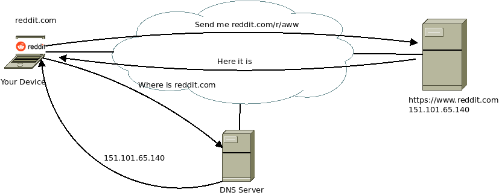
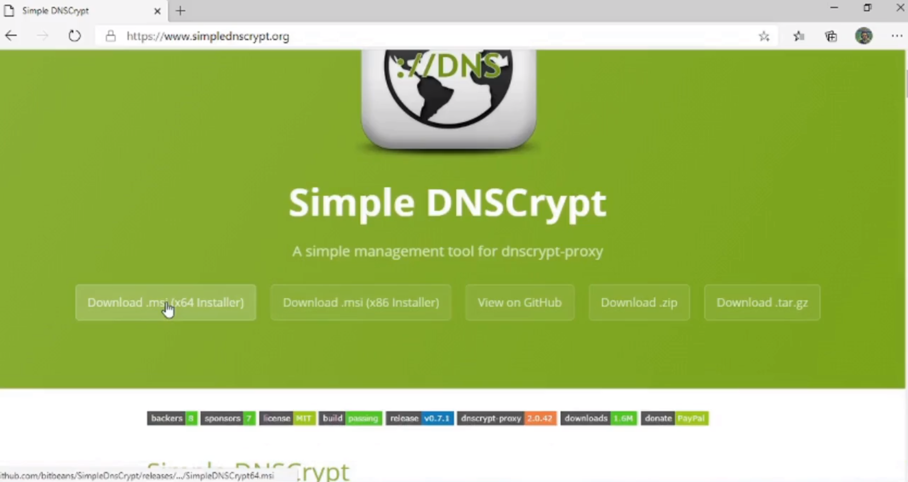
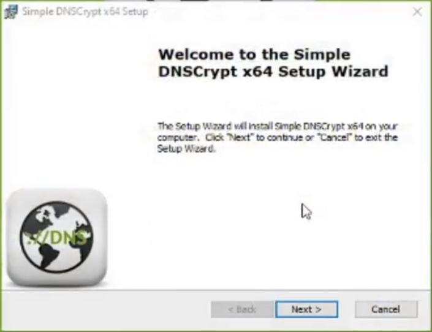
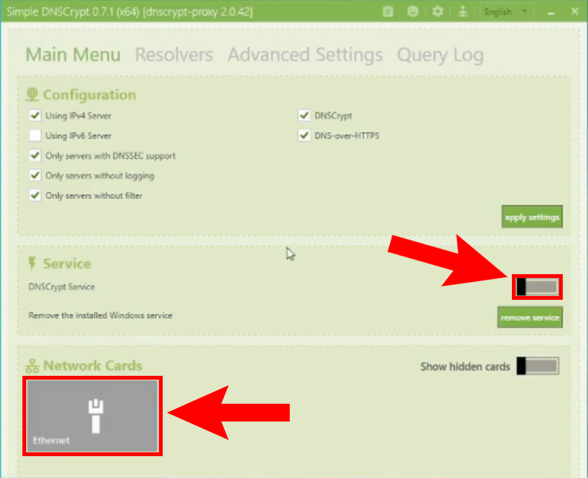

We are used to easy to remember names (URL) for the services on the internet, such as reddit.com, google.com, or cbs.dk. Computers however don't care about easy to remember, they don't have any trouble recalling a 128 bit binary address. So anytime a program on your computer tries to access a URL, they need to convert the URL into an IP address they can understand. Much like looking up a number on the phone book. This lookup is done through a service called Domain Name System (DNS).

So when you type in Reddit.com in the address bar of your browser, your browser uses the DNS in the background. After you type the address the following events occur:

1- Your computer asks the DNS server for the IP address for reddit.com.

2- DNS server sends the IP address requested.

3- Your computer then sends a request for the content you wanted to this IP address.

4- The Server responds with the content requested.

5- You get to see cute cat videos.

## Troubles with the Classic DNS

The classic DNS protocol was designed in the olden days when Internet was secured with a gentlemen's agreement between the users. Everyone on the internet (all 60 of them) were friends and would never do anything to harm each other.

Unfortunately, those days are over and the systems design is allowing various malicious actors to abuse it.

First weakness is that DNS queries and responses are not encrypted. Meaning anyone observing the traffic between you and the DNS server can have a pretty good idea what you are doing online without needing to have access to all your traffic.

Second weakness is that DNS does not support authentication. This means the protocol does not have mechanisms to make sure someone sending or responding to the requests is indeed who they claim to be. This allows malicious parties to (A) impersonate a legitimate DNS server, (B) impersonate a victim. To either redirect them to malicious content, or to create a flood of traffic coming their way.

A version of this redirect trick is used to censor content online. In some countries, the governments have used DNS services to censor content. The government would redirect traffic to sites they deemed inappropriate to servers they set up. The image below is from Turkey. Back when Turkey banned Twitter through DNS settings, the citizens quickly started sharing information on how to circumvent the ban by changing the DNS settings.

## DNSCrypt 

DNSCrypt is a protocol designed to replace classic DNS traffic. The protocol supports encryption and authentication so that typical attacks affecting DNS do not affect DNSCrypt. DNSCrypt makes it harder to snoop on, or to attack the users. It may also have some side benefits such as circumventing legal DNS redirects.

In this tutorial, we will go over how to set up DNSCrypt to secure your connection. Simple DNSCrypt is a simplified interface to set up DNSCrypt on Windows machines. 

Download the [Simple DNSCrypt from here.](https://www.simplednscrypt.org)

Install DNSCrypt.

You need to turn on the service and enable it in the network interfaces.

By default it will use the fastest provider that supports DNSCrypt. You may want to limit it to reputable providers if you are a bit paranoid.
\vfill
 This work is licensed under a [Creative Commons Attribution 4.0 International License](http://creativecommons.org/licenses/by/4.0/).
