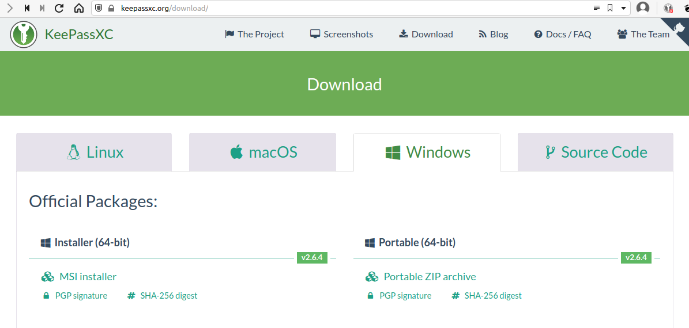
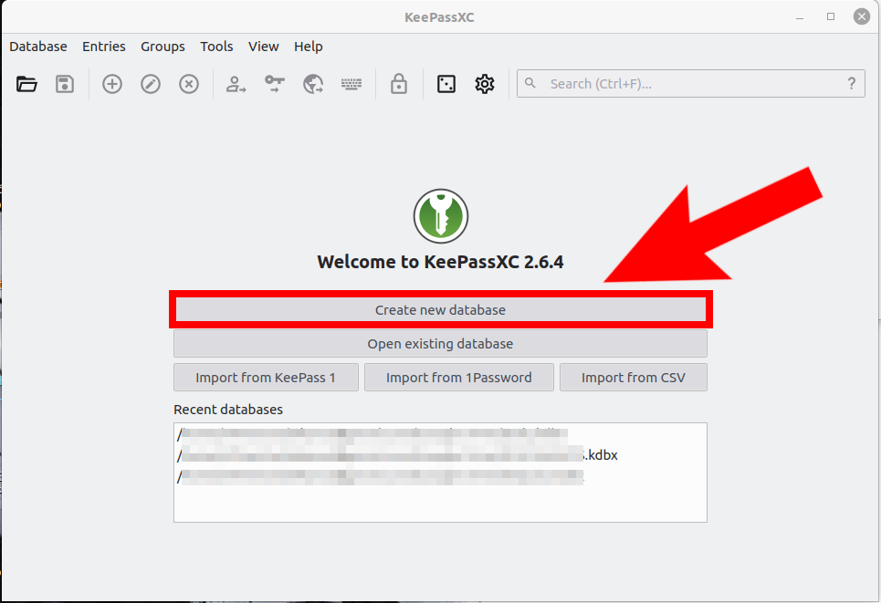
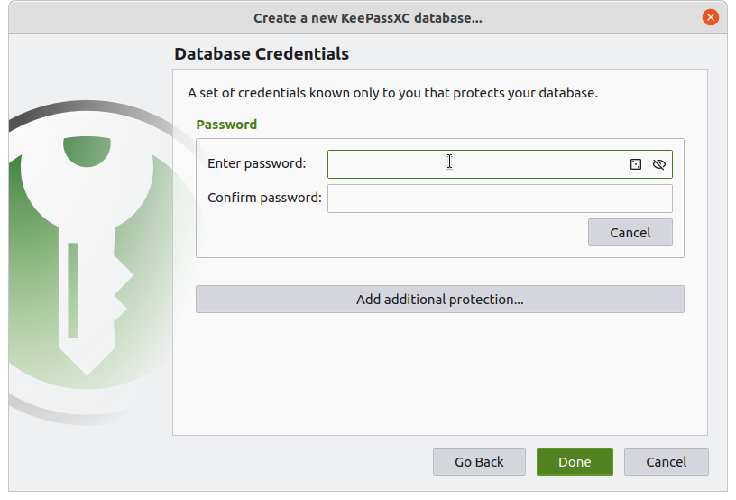
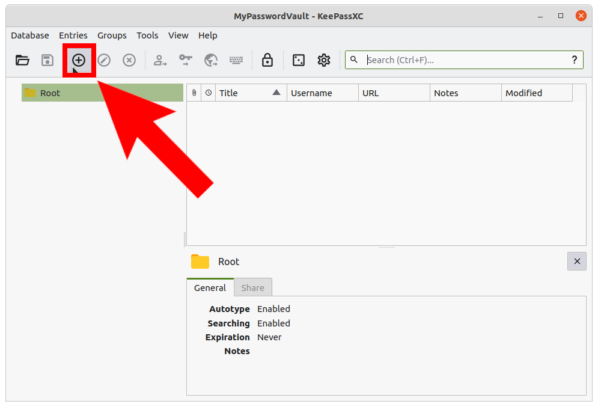
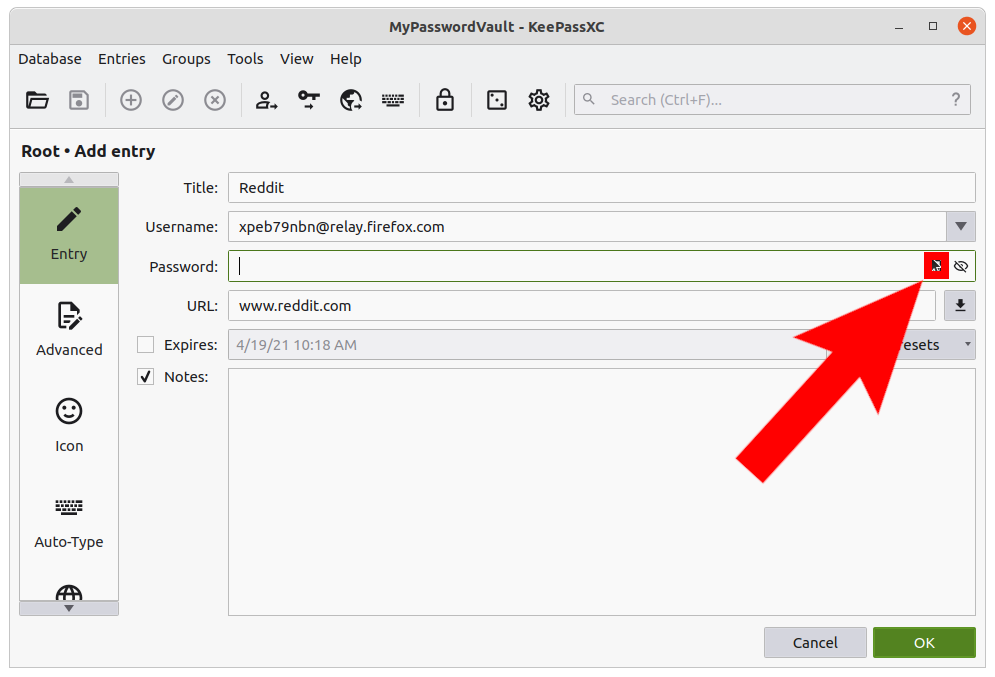
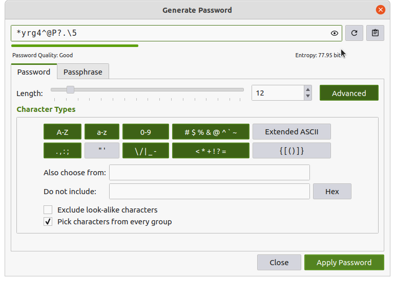
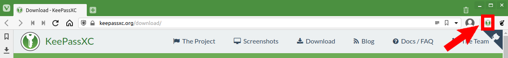
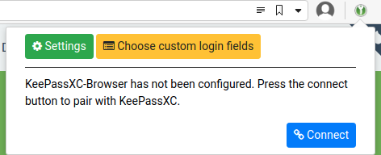
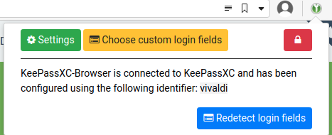
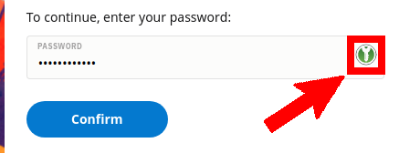

A good password is hard to remember. Now think about the need for a different password for every service... All of a sudden the number of hard to remember passwords you need to remember has skyrocketed. While this may not be a problem for a memory champion like Jonas von Essen, it is not easy for the rest of us mortals.

Your first reaction to this problem may be to write down your passwords... Then the problem is to protect those notes or files. One way is to encrypt the passwords file you have. That is the essence of a password manager. Of course password managers come with additional features such as automatic sign-ins, password generators and such that make your life easier.

There are many different password managers out there. Some integrated into your browser (such as the one in firefox or in chrome), others as cloud services, yet others as stand alone applications. The choice is dependent on your unique circumstances. I recommend open source alternatives, as they are free and offer you the most control. 

I caution you against free cloud based solutions, no matter how reputable. Last year, a popular password manger suddenly changed their terms of use for the free tier. Effectively turning into ransomware overnight.

## Setting up KeepassXC

KeepassXC is an open source password manager, it has been around a long time and is audited by external parties. It is not the most convenient (it requires you to set up the browser plugin and mobile app separately), but it is very reliable.

[Download KeepassXC from here.](https://keepassxc.org/) You will need the 64 bit msi file. Double click and install the file.

The first time we use, we need to create a password database. Click "Create new database" on the first page.

Continue through the next few steps. What you may want to consider is the password you want to put on this database. It needs to be really strong, yet also easy for you to remember... Just think of this as the only password you need to remember from this day forward. Pick a strong password and memorize it. You can also add multifactor authentication in the form of a YubiKey or a separate key file... I won't go into those just now.

This file will store your passwords. So if you place this file in a cloud drive such as google drive or dropbox you can access it from your mobile device as well.

## Basic Usage

Next time you open KeepassXC, you will see the screen below with your existing database already selected. Just enter your password to open the password database.

The database is empty for now, when you open a new account on a web site you come to your database and click "Add a new entry".

Fill in the information on this page. If you save the URL, you can later use keepass browser plugin to automatically fill in the fields on those web sites. You can either fill in a password by hand, OR let keepass autogenerate a strong password for you. If so, click on the small dice icon "Generate new password".

Below you can see how you can alter the character set and password length to auto generate a strong password.

You can start using your password manager without ever setting up any other integration right away. You can copy the password for the web sites you recorded in the database and paste it to your browser. If you want more convenience keep reading.

## Browser Integration

You would likely want your password manager to automatically fill in those hard to remember passwords for you. If so you need a few integrations. You need to install browser add-ons to make your web browser to talk to your password manager. There are add-ons for most browsers (Most browsers use chrome add-on format). So get the right add-on for your browser.

[Firefox Add-on](https://addons.mozilla.org/en-US/firefox/addon/keepassxc-browser/)

[Chrome Add-on](https://chrome.google.com/webstore/detail/keepassxc-browser)

Once installed, it will add a small lock icon to the right of your address bar. Click that icon to set up Keepass integration. **For this to work, keepassXC should be running and unlocked in the background.**

Click connect, you will be asked to give a name to the connection. Give it any name you want.

When you click that green icon next time you should see something like this:

Keepass will now offer to fill in your passwords while it is running in the background. You will see a green keepass icon in the authentication fields. When you click on it it will automatically fill in the password.

Remember KeepassXC needs to be running and unlocked in the background for this to work. It times out after a while, so you may need to enter your keepass password every once in a while.

## Other Integrations

There are also a few cell phone apps for KeepassXC. If you stored your password database file on google drive or dropbox, you can use these apps to access your passwords on your mobile device as well.

## Have You Been PWNED?

I highly encourage you to go and check if your passwords have been leaked in a databreach incident. This is especially bad if you used the same password that was leaked in multiple web sites.

Go to [haveibeenpwned.com/](https://haveibeenpwned.com/) and check if your e-mail address is associated with databreaches.

Have any of you been pwned?

How many databreaches was your e-mail associated with?
\vfill
 This work is licensed under a [Creative Commons Attribution 4.0 International License](http://creativecommons.org/licenses/by/4.0/).
