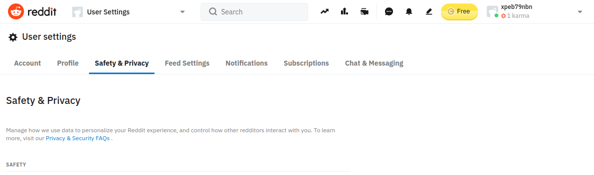
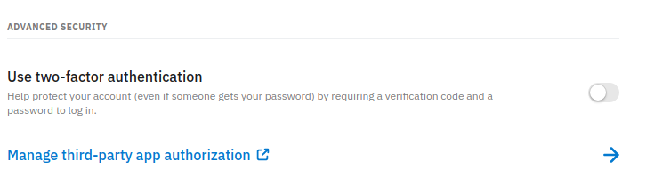
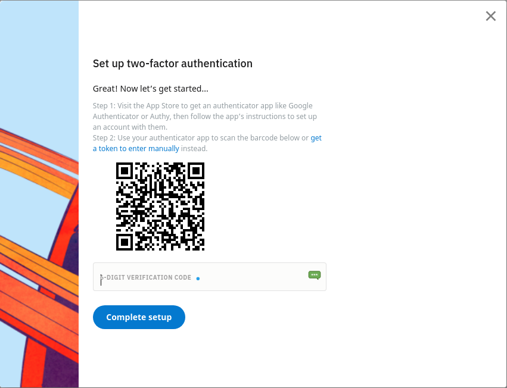

Modern authentication uses three factors:

1- Something you know (e.g. password)

2- Something you are (e.g. fingerprint)

3- Something you have (e.g. keys)

Multi-factor authentication means you don't rely on just one, but multiple different factors. This is crucial for accounts that guard sensitive personal, or financial information. Such as bank accounts, or e-mails. With multi-factor authentication, even if the adversary gains access to one factor of authentication, there is another one to prevent them from gaining control.

In Denmark we have a national authentication system in the form of nem-id. The nogle kort is something that you have and can be validated by the system. Unfortunately the rest of the internet is not entirely on board with our wonderful nem-id system. So we need to use other methods. 

Some of these methods can be a bit crude, such as sending one time codes via SMS or e-mail. Others can be more sophisticated, such as using an authenticator app on your cell phone, or a hardware key like yubikey.

In this activity we will learn about using Google Authenticator. Google authenticator is a authenticator app designed to increase the security of your important accounts.

## Setting Up Google Authenticator

Download and install google authenticator app from app store, or play store.

[Play Store Link for Google Authenticator](https://play.google.com/store/apps/details?id=com.google.android.apps.authenticator2&hl=en_US&gl=US)

[App Store Link for Google Authenticator](https://apps.apple.com/us/app/google-authenticator/id388497605)

## Setting up A Reddit Account for Google Authenticator

You want multifactor authentication for your critical accounts. So maybe Reddit is not the best example, but it shows the steps clearly for setting up authenticator.

On reddit web page, click on your account and go to settings. Click "Safety & Privacy" tab.

Scroll down until you see two-factor authentication.

It will ask for your password, enter and continue. You will see a QR code on the screen.

Now switch to your google authenticator app on your cell phone. (Google authenticator app does not allow screenshots, so use your imagination from here on out.) Click the + icon on the bottom and select scan a QR code.

Scan the code on the screen, you will see a verification code in your authenticator app. Enter this code in reddit. 

**This is important**. You may loose access to your cell phone or your authenticator app. To recover your account, there will be some single use codes generated on Reddit. Copy and save these in your password manager. So if you ever loose access to your authenticator app, you can reset your account. **You may loose access to these accounts if you loose access to both the app and the one time codes.** So make sure you save them safely in your password manager.

Next time you log in, after the password Reddit will ask for a code. Open your authenticator app, enter the six digit number from the appropriate entry.

\vfill
 This work is licensed under a [Creative Commons Attribution 4.0 International License](http://creativecommons.org/licenses/by/4.0/).
