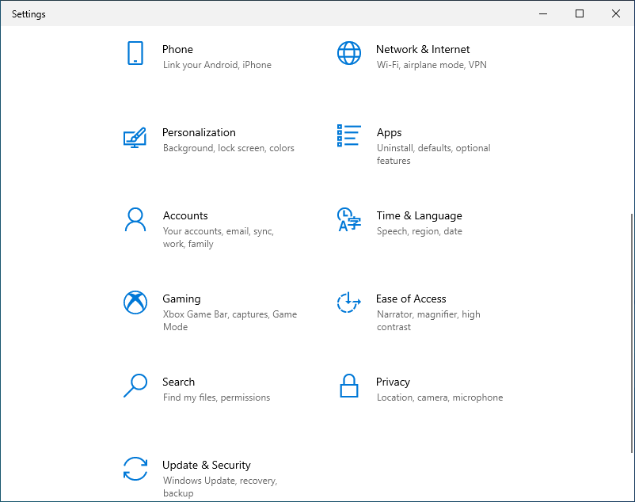
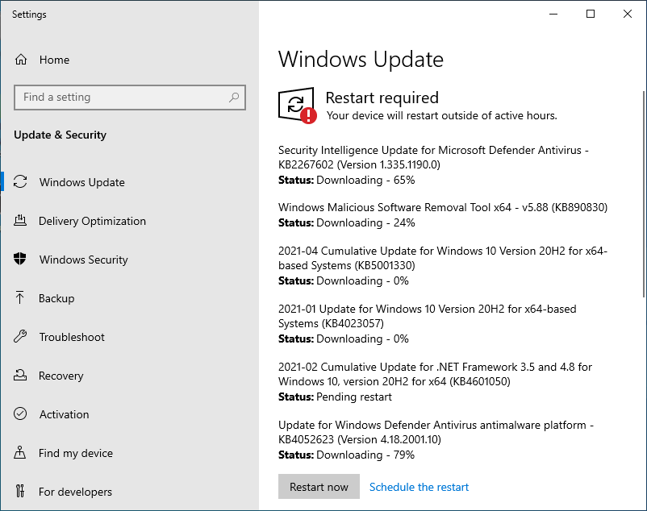
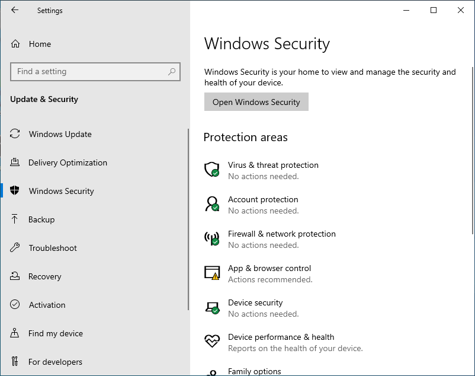
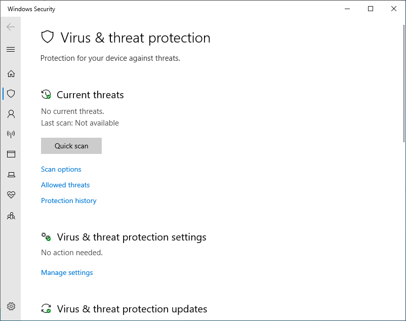
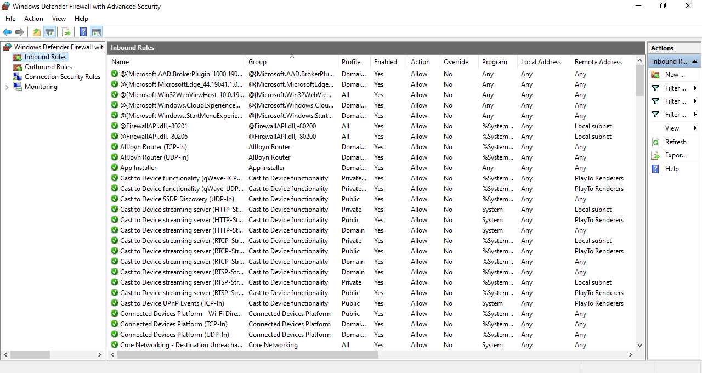

In the lecture video we talked about the importance of software updates, anti-virus software, and firewalls. In this activity we will go over MS Windows operating systems relevant settings.

Every setting we will talk about today can be found in the "Update & Security" tab of the "Settings".

## Software Updates

Software bugs are a part of our lives. In worst cases, these bugs can compromise our systems' security. Therefore it is important to keep all the software on our system up to date.

First tab in the "Update & Security" settings is the update settings. Make sure your system was updated recently and there aren't any security updates that are being held back.

It is important that your system receives and installs the security updates as fast as it can. So don't prevent updates, and don't postpone system restarts after updates too much.

One short coming of Windows update is that it only updates Microsoft software on your computer. Linux on the otherhand updates all software that is installed through central repositories. 

## Anti-Virus

Malware is unfortunately all too common, and anti-virus products have now became a standard part of our operating systems. Windows comes bundled with Microsoft Defender. For a regular end user, Microsoft Defender is quite capable. What you need to ensure is that the Virus definitions are up to date, and run regular scans of your system.

In the Windows Security settings, click on the "Virus & Threat Protection".

In this screen you can check update status and schedule regular anti-virus scans.

Some malware may be hard to remove once it takes root in your system (e.g. rootkits). These may require special software to uproot, but for most situations having an up to date Windows Defender should be enough.

You may hear some people claim that other operating systems are virus-proof. Mac and Linux users surely enjoy a much lower risk profile when it comes to the number of viruses that are targeting them. As a Linux user, I must admit this is more due to us representing a smaller share of the market (therefore not as profitable to the malware programmers), than it is due to any inherent security of our operating systems. Windows controls 90% of the desktop operating system market, and therefore presents a juicier target.

## Firewall

In the Security settings tab, if you select "Firewall & network protection",  you can review Windows Defender Firewall settings.

For most users, default settings should be sufficient. What you need to recall here is that a Firewall is a set of rules that define acceptable traffic. For an end user machine, this means allow outbound traffic, but only allow inbound traffic that matches the rules.

Windows operating system has quite a few components that require their own rules, therefore the advanced settings you see may appear confusing at first. You likely won't need to alter these rules unless you are setting up a server. Even when you want to add rules for an app (e.g. web server) it is simplified through

## What Good Is It To Know

For the most part Windows has sane defaults for the configuration of these security settings. So most users go about their lives happily without ever checking these out. If you notice that these settings are not active (updates, firewall, anti-virus) then that is a pretty good sign something is amiss with your system.
\vfill
 This work is licensed under a [Creative Commons Attribution 4.0 International License](http://creativecommons.org/licenses/by/4.0/).
